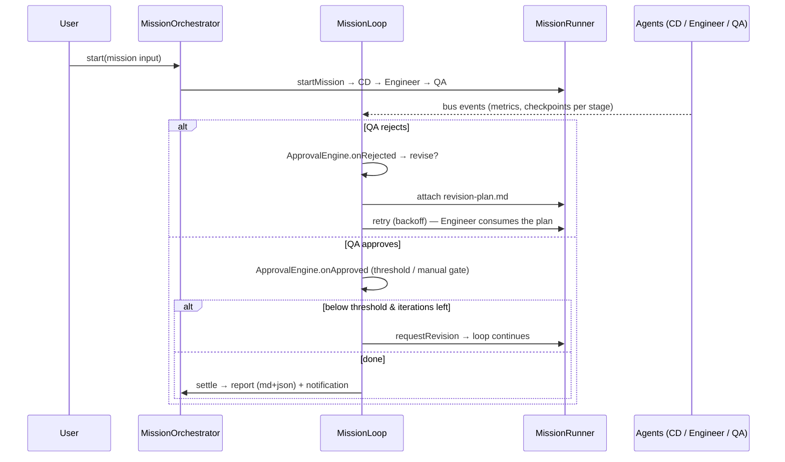

# Architecture

Three Electron processes, one typed contract between them — and at the center,
a provider-agnostic **Agent Runtime** (`src/core/`) that owns all orchestration.

```
src/
├── core/                    # ★ The Agent Runtime — pure TS, no electron/db/UI imports
│   ├── runtime/
│   │   ├── types.ts         # Roles, statuses, stages, AgentEvent, RuntimeEvent, Artifact
│   │   ├── Agent.ts         # Agent = RESPONSIBILITY: execute(ctx) → AsyncGenerator<AgentEvent>
│   │   ├── Mission.ts       # Mission model, snapshots, stage helpers
│   │   ├── EventBus.ts      # Typed pub/sub — everything communicates through events
│   │   ├── MissionRunner.ts # Sequential pipeline executor: run/pause/resume/cancel/retry
│   │   └── AgentRuntime.ts  # Facade: agent registry + active missions + the bus
│   ├── providers/           # Provider = IMPLEMENTATION of work
│   │   ├── types.ts         # ProviderType/Status, Capability, descriptors, requests
│   │   ├── Provider.ts      # THE provider contract + PlaceholderProvider
│   │   ├── ProviderEvents.ts# Stream events (=AgentEvent) + lifecycle events
│   │   ├── ProviderRegistry.ts  # register/unregister/get/list/findByCapability/defaults
│   │   ├── ProviderManager.ts   # Connection, health, selection, execution boundaries
│   │   ├── SimulatorProvider.ts # The built-in provider (scripted, paced, cancellable)
│   │   ├── placeholders.ts  # Roadmap: GPT API, Claude Code, Codex CLI, vision tiers…
│   │   ├── simulator/       # Scripts (CD / Engineer / QA), pacing steps, SVG previews
│   │   ├── claude-code/     # ★ First autonomous provider — real Claude Code CLI
│   │   │   ├── ClaudeCodeProvider.ts  # Provider impl: health, concurrency, event mapping
│   │   │   ├── ClaudeCodeSession.ts   # Workspace prep, spawn, watch, timeout, cancel
│   │   │   ├── ClaudeCodeProcess.ts   # Launcher/handle ports + async queue (host injects
│   │   │   │                          #   child_process; tests inject fakes)
│   │   │   ├── ClaudeCodeParser.ts    # stream-json NDJSON → normalized events
│   │   │   ├── ClaudeCodeEvents.ts / ClaudeCodeConfig.ts / README.md (diagrams)
│   │   └── manual/          # ★ The manual bridge — AI without APIs
│   │       ├── ManualProvider.ts    # Prompt → clipboard → wait → import → artifacts
│   │       ├── PromptGenerator.ts   # Deterministic 6-section prompts per capability
│   │       ├── PromptParser.ts      # Markdown → sections/code/decisions/tasks/verdict
│   │       ├── ManualArtifacts.ts   # Heading conventions → studio artifacts
│   │       ├── ManualSession.ts     # Session records + persistence port
│   │       └── ClipboardService.ts  # Clipboard/opener ports (host injects electron)
│   └── agents/
│       ├── ConfiguredAgent.ts   # The ONE Agent impl: config + delegation to a provider
│       └── roster.ts            # The default team as pure configuration
│
├── shared/                  # The only code visible to all processes
│   ├── types.ts             # Domain models + runtime wire-type re-exports
│   └── ipc.ts               # IpcContract — every channel + push channel + types
│
├── main/                    # Node side: storage, files, runtime host
│   ├── index.ts             # App lifecycle: scheme → db → runtime → ipc → window
│   ├── window.ts            # BrowserWindow (hiddenInset title bar, dark bg)
│   ├── media.ts             # media:// protocol + file library in userData/library/
│   ├── runtime/             # Runtime host — the ONLY place runtime meets storage/UI
│   │   ├── index.ts         # Boot: register providers (simulated today)
│   │   ├── context.ts       # Project brief + notes + inspiration → MissionInput
│   │   └── bridge.ts        # Bus → renderer push + persistence (missions, artifacts,
│   │                        #   timeline, specs, screenshots, QA items)
│   ├── db/                  # better-sqlite3: one repository module per table
│   │   ├── index.ts         # Connection + user_version migrations
│   │   ├── schema.ts        # Ordered migration list
│   │   └── projects|notes|specs|inspiration|screenshots|qa|timeline|missions|artifacts.ts
│   └── ipc/                 # One registrar per domain; registry.ts = typed handle()
│
├── preload/index.ts         # ~20 lines: whitelist channels, expose window.api.invoke
│
└── renderer/src/
    ├── lib/                 # api.ts (typed IPC facade), files, format, cn()
    ├── stores/              # Zustand: projects, ui (tabs/panels/palette), timeline
    ├── hooks/               # useShortcuts, useProjectData (per-project loader)
    ├── components/
    │   ├── ui/              # shadcn-style primitives (button, dialog, command…)
    │   ├── layout/          # TitleBar, Sidebar, Workspace, WelcomeScreen
    │   └── command/         # Command palette
    └── features/            # One folder per panel
        ├── projects/        # Item row + create/rename/delete dialogs
        ├── inspiration/     # Drag-and-drop gallery (images + URLs)
        ├── notes/  spec/    # Both built on features/docs/DocListEditor
        ├── docs/            # Shared master–detail autosaving editor
        ├── session/         # Live mission control: transcript, progress, controls
        ├── screenshots/     # Screenshot history grid (agents add previews)
        ├── qa/              # QA feedback list with severity + resolve
        └── timeline/        # Activity rail, grouped by day
```

## The Provider Layer

"Who does the work" and "how the work is executed" are separate axes:

- An **Agent** is a responsibility — Creative Director, Engineer, Design QA.
  There is exactly one implementation, `ConfiguredAgent`: role + providerId +
  preferences + memory + configuration. Changing implementations is a
  configuration change, never a code change.
- A **Provider** is an implementation — the Simulator today; Claude Code,
  Codex CLI, GPT/Gemini APIs, or a human review queue tomorrow. All implement
  one contract: `connect() / disconnect() / execute(request) →
  AsyncGenerator<ProviderStreamEvent>`.

```
UI (Session panel, Settings, sidebar)
 ↓ typed IPC + runtime:event push channel
Runtime (AgentRuntime → MissionRunner)          ← only knows Agents
 ↓ agent.execute(missionContext)
Agent (ConfiguredAgent: role + config)          ← resolves its provider
 ↓ providerManager.executeFor(agentId, request)
Provider (Simulator | Claude Code | GPT | …)    ← selected via registry
 ↓ execute(): AsyncGenerator<ProviderEvent>
Execution (scripted playback / CLI process / API stream / human)
```

The **ProviderRegistry** owns every provider (including greyed-out
placeholders) with capability lookup and per-capability defaults. The
**ProviderManager** owns connection state, health, per-agent selection and
execution boundaries, announcing everything as lifecycle events on the bus —
ProviderConnected, ProviderDisconnected, ProviderSelected,
ProviderExecutionStarted, ProviderExecutionFinished, ProviderError — which
the bridge writes into the per-project activity timeline. Providers stream
the same event vocabulary agents emit (`ProviderStreamEvent = AgentEvent`),
so nothing above them needs translation. Selections persist in the settings
table and are restored at boot.

## The Autonomous Mission Loop

`src/core/runtime/orchestrator/` turns single missions into self-driving
build cycles — build → review → revision plan → rebuild — until the quality
gate passes or a policy limit stops it:

- **MissionOrchestrator** owns the lifecycle: one bus subscription routes
  events to per-mission **MissionLoop** instances. It never touches agents
  or providers — provider independence is structural, not conventional.
- **LoopPolicy** (Settings → Missions): autonomy switch, max iterations,
  max runtime, max cost (reserved), quality threshold, stop-on-failure,
  manual-approval gate, auto-export, notifications. **RetryStrategy**
  governs agent *errors* (backoff + cap) separately from QA rejections.
- **ApprovalEngine** is the single authority on "done": QA verdict +
  parsed report scores vs threshold, iteration/duration limits, manual
  approval parking (`mission.awaiting-approval`).
- **RevisionPlan** converts each rejection into a structured
  `revision-plan.md` (priority / problem / reason / suggested fix /
  affected components / expected outcome) attached by the orchestrator —
  the Engineer's only required input for the next iteration.
- **MissionMetrics** streams `mission.metrics` snapshots (current agent,
  task, iteration, elapsed, artifacts, files, health, ETA) that power the
  CI-style dashboard in the Session panel.
- **Checkpoints** are recorded after every agent stage
  (`mission_checkpoints`), and every settled mission stores a **report**
  (summary, iterations, duration, quality, artifacts, screenshots, files,
  review history, timeline, lessons learned) as JSON + Markdown —
  auto-exported to `userData/reports/` when enabled. History supports
  search, filter, archive, replay (duplicate) and compare; rollback uses
  `requestRevision` to send a settled mission back to engineering.



## The Visual Review Engine

`src/core/review/` treats screenshots as first-class artifacts and reviews as
structured, serializable data — architected so AI vision is a drop-in later:

- **Screenshots** (`ScreenshotArtifact.ts`) carry project/mission scope,
  **iteration**, viewport, theme, source (engineer | import | agent) and role
  (reference | current). Engineer-produced previews flow through the same
  import path as hand-imported captures.
- **Iterations** are append-only build cycles per project
  (building → in-review → approved/rejected); every mission's screenshots,
  feedback and verdicts stay attached to their iteration forever.
- **Annotations** (`Annotation.ts`) are coordinate-anchored (normalized 0–1,
  zoom-proof) notes with category, severity and author — human clicks today,
  vision-provider output tomorrow, identical objects either way.
- **Review sessions** (`ReviewSession.ts`) hold an eight-category score sheet
  (hierarchy, spacing, typography, colour, motion, responsiveness,
  accessibility, originality — each score/notes/confidence), a summary and a
  recommendation (approve / revise / reject).
- **ReviewEngine** (`ReviewEngine.ts`) is the only orchestrator: it imports
  screenshots, opens sessions, records annotations/scores, and settles
  iterations — emitting `review.*` events on the runtime bus (bridge →
  timeline, renderer → live UI). Persistence is a store port (SQLite in
  main, fakes in tests).
- **UI**: the Review tab is a Figma-Inspect-style workspace — reference and
  current-build galleries, side-by-side and slider comparison with zoom /
  pan / fullscreen, click-to-annotate with numbered markers, score sheet,
  verdict buttons and per-iteration history.

### How GPT Vision / Claude Vision plug in — zero runtime changes

`ReviewEngine.registerVisionProvider()` accepts the `VisionReviewProvider`
seam: `review({session, screenshots, spec})` returning annotations, scores,
a summary and a recommendation. A future vision provider fetches the capture
files, calls its model, and returns those objects; the engine records them
through the exact methods human reviews use — same events, same timeline,
same UI, same iteration lifecycle. Nothing outside `ReviewEngine` knows
whether a review came from a person or a model (`reviewer` is just an id),
mirroring how the runtime never learned what powers an agent.

## The Agent Runtime

`src/core/` is the operating system the providers install into. It is pure
TypeScript with zero imports from electron, the database, or the renderer —
the same code runs headless in tests.

**Agent contract.** The runtime only knows `Agent` — identity plus
`execute(context): AsyncGenerator<AgentEvent>`. Agents receive a
`MissionContext` (brief, notes, references, upstream **artifacts**, attempt
number, AbortSignal) and stream `status` / `message` / `progress` /
`artifact` / `stage` / `verdict` events. The renderer cannot tell a simulator
from Claude Code; only the provider assignment differs.

**Artifacts, not conversations.** Agents never talk to each other. Each
yields artifacts (creative-spec.md, implementation-plan.md,
hero-component.tsx, build-log.txt, qa-feedback.md, preview SVGs); the
MissionRunner accumulates them on the mission and hands the full set to every
downstream agent via its context.

**MissionRunner.** Executes the pipeline (Creative → Engineer → QA)
sequentially, translating each agent's stream into bus events. Pause works
via an await-gate between events (generator state is preserved); cancel via
AbortSignal; retry re-runs from the recorded failed step with an incremented
attempt counter. A rejected QA verdict marks the *previous* step failed — the
reviewer finished its job; the reviewed work is what needs rework. Because a
step is self-contained (agent + stage + artifact inputs), parallel execution
later only replaces the runner's for-loop with a scheduler.

**Event bus.** Synchronous typed pub/sub carrying `mission.*`, `agent.*` and
`timeline.entry` events. In main, `runtime/bridge.ts` is the single
subscriber that (1) forwards every event to renderer windows over the
`runtime:event` push channel and (2) persists durable consequences through
the existing repositories — specs get authored by agents, preview images land
in Screenshot History, rejection reasons file QA items, and every curated
step is written to the activity timeline. Agents and the runner know nothing
about storage.

**The Simulator.** `SimulatorProvider` turns timed scripts into paced,
cancellable streams (scaled by `AI_STUDIO_SIM_SPEED` for demos/tests). The
scripted narrative exercises every runtime path: QA rejects the first build
(footer anchoring), the mission parks as failed, Retry sends the Engineer on
a rework pass with the QA feedback artifact in context, and the second review
approves. The Simulator is deliberately just another registered provider —
it goes through the same registry, selection, connection and execution-event
path a real provider will, which is what validates the architecture.

## The Manual Bridge — real AI without APIs

`ManualProvider` makes any AI the user can reach in a browser (ChatGPT,
Claude.ai, Gemini) a first-class provider — no browser automation, no
scraping, no terms violations. The human carries the payload:

1. `execute()` builds a **deterministic prompt** (PromptGenerator: MISSION /
   PROJECT CONTEXT / REFERENCES / PREVIOUS DECISIONS / TASK / EXPECTED
   OUTPUT FORMAT — same inputs, same prompt), copies it to the clipboard,
   records a **ManualSession**, emits `manual.prompt`, and parks its stream
   in `waiting`.
2. The Session panel shows the hand-off card: prompt preview, **Copy**,
   **Open <provider>** (system browser), **Import response**.
3. On import, the stream resumes: PromptParser extracts sections, code
   blocks, decisions, tasks and a QA verdict; ManualArtifacts maps heading
   conventions (`# Creative Spec` → creative-spec.md, `# Build Plan` →
   implementation-plan.md, `# QA` → qa-feedback.md, `# Build Log` →
   build-log.txt, fenced code with filenames → code artifacts) and yields
   them as ordinary artifact events. QA responses yield real verdicts, so
   rejection → rework → retry works across a human round-trip.
4. The session (prompt, response, duration, artifacts, decisions, tasks) is
   persisted to `manual_sessions` — searchable via `manual:sessions`.

**The runtime cannot tell the difference.** MissionRunner sees a provider
that took a while between events — pause, cancel and retry all work
mid-wait, and orphaned waits are cancelled at boot.

### ManualProvider vs a future APIProvider

| | ManualProvider | APIProvider (future) |
| --- | --- | --- |
| Transport | Human + clipboard | HTTP/SDK stream |
| `connect()` | No-op (user brings the session) | Auth/token exchange |
| Latency | Minutes (parked in `waiting`) | Seconds (streams live) |
| Response ingestion | Pasted markdown → PromptParser | Same parser, fed programmatically |
| Runtime contract | `execute() → AsyncGenerator<ProviderEvent>` | Identical |

Both funnel through the same PromptGenerator/PromptParser conventions —
an APIProvider is essentially ManualProvider with the human replaced by an
HTTP call, which is exactly why swapping one for the other never touches
the runtime.

## The Claude Code provider — the first autonomous provider

Exactly the addition predicted in earlier phases, delivered with zero runtime
changes: `ClaudeCodeProvider implements Provider` (`type: 'cli'`,
`capabilities: ['engineering']`). Each mission step gets a **workspace**
(`userData/workspaces/<mission>-attempt-N/`) holding PROMPT.md, `context/`
artifacts (creative spec, prior QA feedback), `mission.json` and
`logs/session.log` for replay. The CLI runs as
`claude -p --output-format stream-json --permission-mode acceptEdits` with
the prompt on stdin; NDJSON is parsed into normalized events (init / text /
tool / result), the workspace is file-watched, and generated files become
ordinary artifacts. Health checks (`claude --version`), timeout kill,
restart-once on immediate crash, SIGTERM on cancel, and actionable error
messages (executable path → Settings) round out session management. All
process and fs access flows through ports implemented in main — the core
stays dependency-free and fully testable with fakes. Full module map and
sequence diagram: [src/core/providers/claude-code/README.md](src/core/providers/claude-code/README.md).

## Key decisions

**One IPC contract.** `shared/ipc.ts` defines every channel with its request and
response types. Main implements it (`ipc/registry.ts` enforces the types),
preload whitelists it, and `lib/api.ts` gives the renderer a typed facade.
Adding a capability = one entry in the contract + one handler + one facade line.

**SQLite stays in main.** Repositories are plain functions over better-sqlite3
(synchronous, transactional). The renderer never sees SQL. Migrations are an
append-only list gated by `user_version`.

**Files live in userData/library/**, served to the renderer through a custom
`media://` protocol (path-traversal guarded) so `webSecurity` stays on. Uploads
travel as `ArrayBuffer` over IPC — no reliance on file paths from the DOM.

**The timeline is the audit log.** Every mutating IPC handler logs a
`TimelineEvent` with an `actor` field. Today the actor is `you`; in Phase 2
agents write to the same log, so the activity rail becomes the orchestration
trace for free.

**Panels are dumb, stores are thin.** Each panel loads its own collection via
`useProjectData` and calls the api facade directly; global state is only what
crosses panels (active project, tab, palette, timeline).

## What remains before real providers

- Real artifacts (actual code files, real screenshots) already flow through
  the artifact events; the bridge materializes them into panels unchanged.
- Parallel or branching pipelines slot into MissionRunner behind the same
  run/pause/resume/cancel/retry controls.
- Provider authentication UIs hang off `ProviderManager.connect()` — the
  status vocabulary (connecting/connected/error) is already wired to
  Settings.
