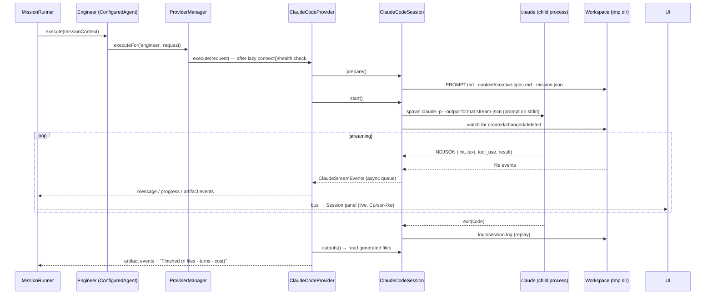

# Claude Code Provider

The first real autonomous provider: drives the Claude Code CLI for the
Engineer role. From the runtime's perspective it is just another `Provider` —
no runtime code knows Claude exists.

## Module map

| File | Responsibility |
| --- | --- |
| `ClaudeCodeProvider.ts` | The `Provider` implementation: health/connect, concurrency, maps session events → generic `AgentEvent`s, collects artifacts |
| `ClaudeCodeSession.ts` | One run: workspace prep (prompt + context + metadata), spawn, file watching, timeout, restart-once, cancel, replay log |
| `ClaudeCodeProcess.ts` | Ports (`ProcessLauncher`/`ProcessHandle`), the async event queue, exit classification. The host injects Node `child_process`; tests inject fakes |
| `ClaudeCodeParser.ts` | `stream-json` NDJSON → normalized `ClaudeStreamEvent`s (init / text / tool / result) |
| `ClaudeCodeEvents.ts` | The internal event vocabulary |
| `ClaudeCodeConfig.ts` | User config (executable, workspace root, timeout, env…), CLI args, health type |

All process and filesystem access flows through ports implemented in the
Electron **main process** (`src/main/runtime/claudeCode.ts`); the renderer
only ever sees runtime events over IPC.

## A mission step, end to end

Cancel: the runtime aborts `context.signal` → the session SIGTERMs the CLI →
exit classifies as cancelled → `MissionCancelledError` propagates exactly as
it does for every other provider. Pause defers event delivery at the runner's
gate (the CLI keeps working and output buffers). Crash-on-launch restarts
once when `autoReconnect` is on; every failure message names the preserved
workspace and the Settings page that fixes it.

## Adding Codex CLI or Gemini CLI

Almost everything here is CLI-generic already:

1. **Reuse as-is:** `ClaudeCodeProcess.ts` (ports, queue, exit
   classification), the session's workspace/watch/timeout/cancel logic, and
   the provider's event-mapping and artifact collection.
2. **Write a parser** (~100 lines): map the tool's output format (Codex CLI
   and Gemini CLI both have JSON output modes) to the same
   `ClaudeStreamEvent` vocabulary — it is deliberately tool-agnostic
   (init/text/tool/result).
3. **Write a config** with the right executable and CLI args.
4. Instantiate a provider with `{ id: 'codex-cli', parser, config }` and
   register it — the placeholder already exists in the registry.

The practical refactor when the second CLI provider lands: rename the shared
pieces to `cli-provider/` and parameterize `parser + args + prompt style`.
That is a file move, not a redesign — the seams are already in place.
